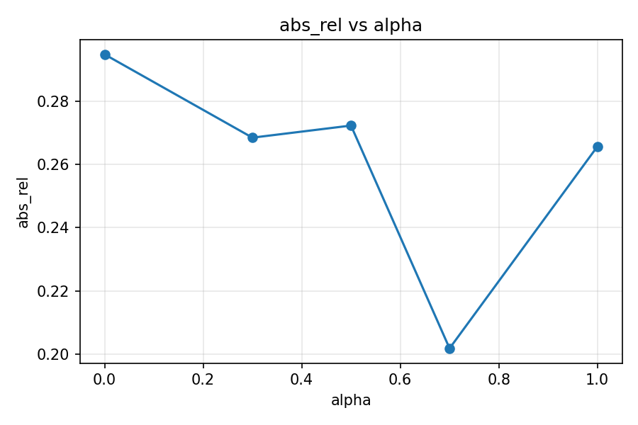
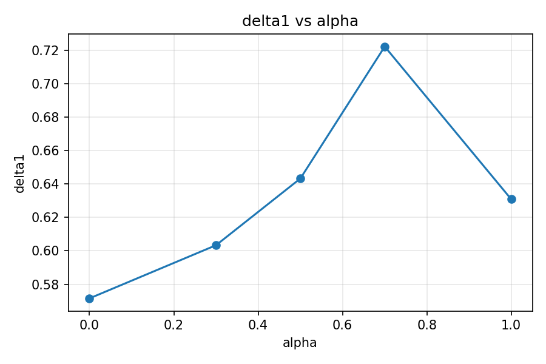
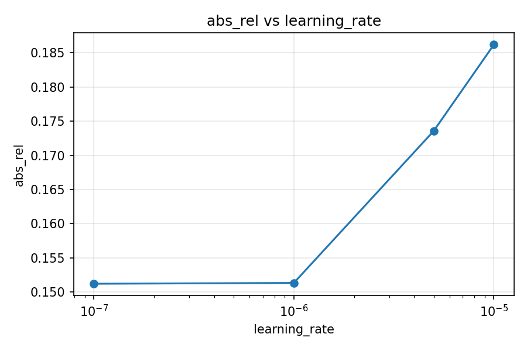
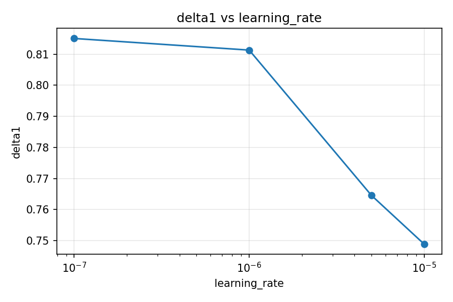
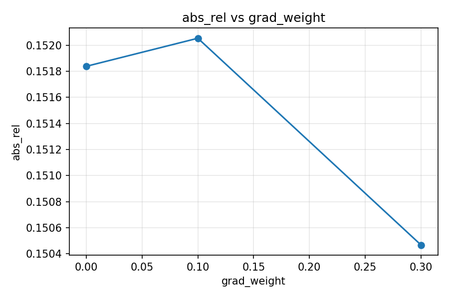
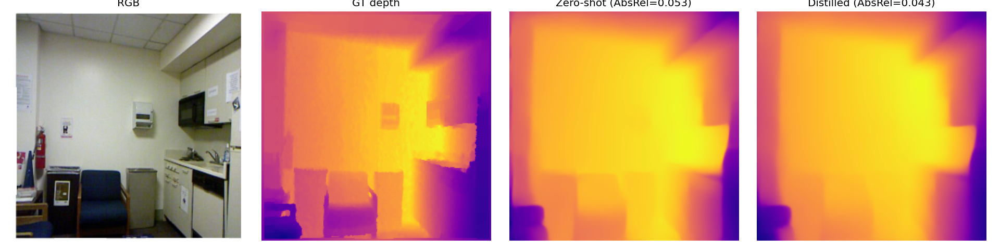

# Distillation and Edge-Aware Loss for Efficient Monocular Depth Estimation

Cal Poly Pomona — ECE 4990 Final Project (Spring 2026)

**Authors:** Alexander Assal • Parsa Ghasemi

We fine-tune a Depth Anything Small student against a frozen Depth Anything Large teacher with two losses: affine-invariant output-level distillation (Distill-Any-Depth, He et al. 2025) and a multi-scale gradient L1 (ZoeDepth, Bhat et al. 2023). Evaluation on a 59-image NYU-v2 PoC test split and a 100-image KITTI eigen subset, with a controlled three-axis sweep over the distillation weight `α`, the gradient weight `β`, and the learning rate.

📄 **Paper:** [`paper/main.pdf`](paper/main.pdf) (LaTeX source in [`paper/main.tex`](paper/main.tex))
🎤 **Presentation:** [`docs/DepthProjectPresentation.pptx`](docs/DepthProjectPresentation.pptx)
🌐 **Demo:** local upload-and-predict web app — `./run_upload_demo.sh`

---

## Headline Result

| Setting | α | β | lr | AbsRel ↓ | δ₁ ↑ | RMSE ↓ |
| --- | ---: | ---: | ---: | ---: | ---: | ---: |
| Zero-shot Depth Anything Small | — | — | — | 0.1550 | 0.8146 | 0.5375 |
| Distilled (default `configs/distill.yaml`) | 0.5 | 0.1 | 1e-5 | 0.2791 | 0.6292 | 0.8898 |
| **Distilled (best after sweep)** | **0.7** | **0.3** | **1e-7** | **0.1505** | **0.8164** | **0.5262** |

**Headline finding:** the recipe is dominated by learning rate sensitivity. At `lr=1e-5` the student collapses; at `lr=1e-7` it slightly beats zero-shot. See [paper](paper/main.pdf) §6 for the full analysis.

KITTI cross-domain (no training): zero-shot AbsRel 0.4022 / δ₁ 0.356; distilled AbsRel 0.4035 / δ₁ 0.349 — essentially identical, the NYU-v2 improvement does not transfer.

---

## Repo Layout

```
src/          training, eval, distillation, datasets, plotting, sweep harness, web demo
configs/      yaml configs (baseline, poc, distill, kitti_eval, sweeps/)
checkpoints/  trained .pt (best distill checkpoint)
data/         NYU-v2 PoC subset + KITTI eigen subset (regenerate with src/prepare_*.py)
outputs/      metrics, plots, predictions, sweep results — all real, not mocked
docs/         results html, presentation pptx, qualitative figures, diagnostics
paper/        CVPR 2023 LaTeX template + main.tex + refs.bib + figs/
references/   upstream repos used for code lifts (gitignored)
tools/        smoke tests for data loaders
```

---

## Method (one paragraph)

The student is `LiheYoung/depth-anything-small-hf` (~25M params, DINOv2 ViT-S + DPT head). The teacher is `LiheYoung/depth-anything-large-hf` (~335M params), frozen. The total loss is

```
L_total = (1 − α) · L_base(student, gt)
        + α       · L_distill(student, teacher)
        + β       · L_grad(student, gt)
```

where `L_base` and `L_distill` are affine-invariant L1 (per-sample median + MAD normalization, then L1) and `L_grad` is the multi-scale Sobel gradient L1 from ZoeDepth at downsampling scales {1, 2, 4}. Input resolution is 256×256, batch size 1, AdamW with weight decay 1e-4 and gradient clipping at L2 norm 1.0. See [paper](paper/main.pdf) §3 for full architecture, equations, and motivation.

---

## Quick Start (run on a fresh machine)

**Requirements:** Python ≥ 3.10, ~6 GB free disk for datasets, optional CUDA GPU (4 GB VRAM is enough — the project was developed on an RTX 3050 Laptop). Everything works on CPU too, just slowly.

```bash
# 1. Clone the repo
git clone https://github.com/arassal/depth-project.git
cd depth-project

# 2. Create an isolated environment
python -m venv .venv
source .venv/bin/activate          # Windows: .venv\Scripts\activate
pip install --upgrade pip
pip install -r requirements.txt
```

**Smoke test** (verifies the model loads and the source compiles — no dataset needed):

```bash
python -m compileall src
python -c "from transformers import AutoModelForDepthEstimation; \
           AutoModelForDepthEstimation.from_pretrained('LiheYoung/depth-anything-small-hf'); \
           print('OK: Depth Anything Small loaded successfully')"
```

**Reproduce the headline numbers** end-to-end (downloads ~5 GB):

```bash
python src/prepare_nyu_v2.py --root data/nyu_v2_poc --val-count 60   # ~3 min
python src/prepare_kitti.py  --root data/kitti --limit 100           # ~1 min
python src/eval.py --config configs/poc.yaml \
    --summary-path outputs/metrics/zero_shot_nyu_summary.json \
    --per-image-path outputs/metrics/zero_shot_nyu_per_image.csv \
    --preview-dir outputs/predictions/zero_shot_nyu                  # ~2 min
python src/train.py --config configs/distill.yaml                    # ~5 min (GPU)
```

Expected output: `outputs/metrics/zero_shot_nyu_summary.json` reports AbsRel ≈ 0.155 and δ₁ ≈ 0.815 — matches Table 1 in the paper.

---

**Prepare NYU-v2 PoC subset** (downloads via Hugging Face):

```bash
python src/prepare_nyu_v2.py --root data/nyu_v2_poc --val-count 60
```

**Prepare KITTI eigen-test subset** (downloads via Hugging Face):

```bash
python src/prepare_kitti.py --root data/kitti --limit 100
```

**Evaluate zero-shot Depth Anything Small on NYU-v2:**

```bash
python src/eval.py --config configs/poc.yaml \
    --summary-path outputs/metrics/zero_shot_nyu_summary.json \
    --per-image-path outputs/metrics/zero_shot_nyu_per_image.csv \
    --preview-dir outputs/predictions/zero_shot_nyu
```

**Train with distillation + gradient loss** (default config):

```bash
python src/train.py --config configs/distill.yaml
```

**Train with the best-found configuration** (override learning rate via a sweep grid):

```bash
python src/sweep.py \
    --base configs/distill.yaml \
    --grid configs/sweeps/beta.yaml \
    --out outputs/sweeps/beta
```

**Evaluate the best checkpoint on KITTI:**

```bash
python src/eval.py --config configs/kitti_eval.yaml \
    --checkpoint checkpoints/distill_best.pt
```

---

## Hyperparameter Sweeps

Three sweeps are committed to `configs/sweeps/`:

| Sweep | Grid | Fixed | Result file |
| --- | --- | --- | --- |
| `alpha.yaml` | α ∈ {0.0, 0.3, 0.5, 0.7, 1.0} | β=0.1, lr=1e-5 | `docs/data/sweeps/alpha.json` |
| `lr_at_alpha07.yaml` | lr ∈ {1e-7, 1e-6, 5e-6, 1e-5} | α=0.7, β=0.1 | `docs/data/sweeps/lr_at_alpha07.json` |
| `beta.yaml` | β ∈ {0.0, 0.1, 0.3} | α=0.7, lr=1e-7 | `docs/data/sweeps/beta.json` |

Each sweep run is isolated: its checkpoint, metrics, per-image CSV, and preview images all land in its own `run_<idx>/` directory. See `src/sweep.py` for the harness.

---

## Web Demo

```bash
./run_upload_demo.sh   # or: python src/demo_web_app.py
```

Open `http://127.0.0.1:8000`, upload any RGB image, get a predicted depth map back. Predictions are stored under `outputs/web_demo/`. The demo runs the **zero-shot** Depth Anything Small (the stronger of the two checkpoints in our small-data regime).

---

## Key Figures

### Training curves (default `distill.yaml` config — shows collapse at epoch 2)


### Hyperparameter sweeps

| | AbsRel ↓ | δ₁ ↑ |
| --- | --- | --- |
| **α sweep** |  |  |
| **learning-rate sweep** |  |  |
| **β sweep** |  | |

### Qualitative

NYU-v2 test sample — RGB | GT | prediction | error:



KITTI outdoor frame — input vs. predicted depth:


---

## What This Repo Verifies

- ✅ Source compiles cleanly (`python -m compileall src`)
- ✅ `DepthEstimationPipeline` loads from `LiheYoung/depth-anything-small-hf`
- ✅ Train / val / test splits are real and frozen (see `outputs/metrics/*_per_image.csv` after eval runs)
- ✅ Every metric in the paper is reproducible from `docs/data/` (sweep JSON) and `docs/data/kitti_*_summary.json`
- ✅ Every figure in the paper is a committed PNG under `docs/assets/figures/`
- ✅ Best-found checkpoint saved at `checkpoints/distill_best.pt`

Full diagnostics: [`docs/diagnostics.md`](docs/diagnostics.md)

---

## References

- L. Yang et al., **Depth Anything**, CVPR 2024.
- X. He et al., **Distill Any Depth**, arXiv 2502.19204, 2025.
- S.F. Bhat et al., **ZoeDepth**, arXiv 2302.12288, 2023.
- R. Ranftl et al., **Vision Transformers for Dense Prediction (DPT)**, ICCV 2021.
- R. Ranftl et al., **MiDaS**, TPAMI 2022.
- M. Oquab et al., **DINOv2**, arXiv 2304.07193, 2023.
- N. Silberman et al., **NYU-v2**, ECCV 2012.
- A. Geiger et al., **KITTI**, IJRR 2013.

Full bibliography in [`paper/refs.bib`](paper/refs.bib).
