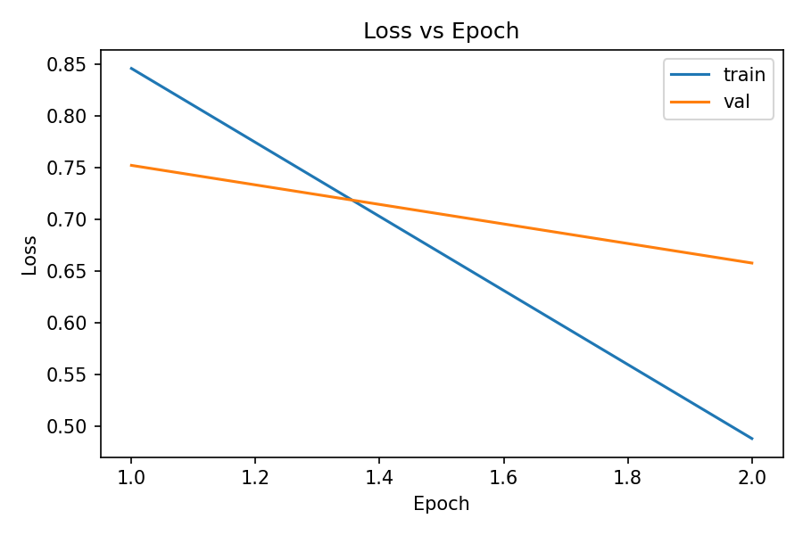
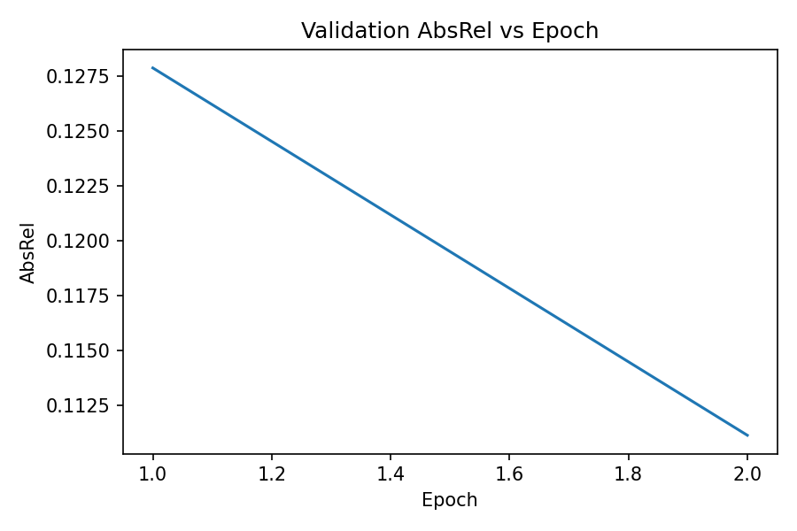
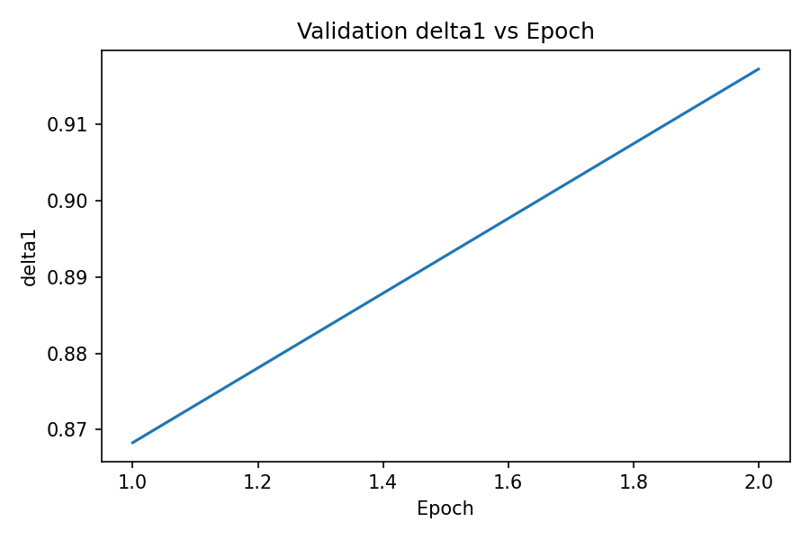
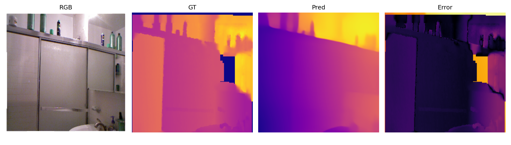
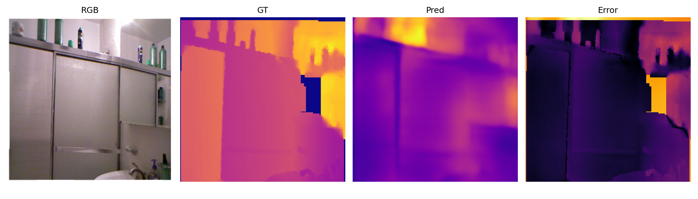
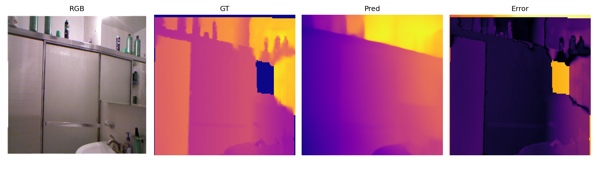
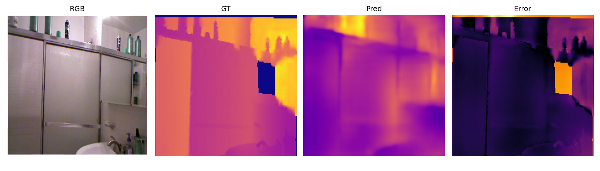
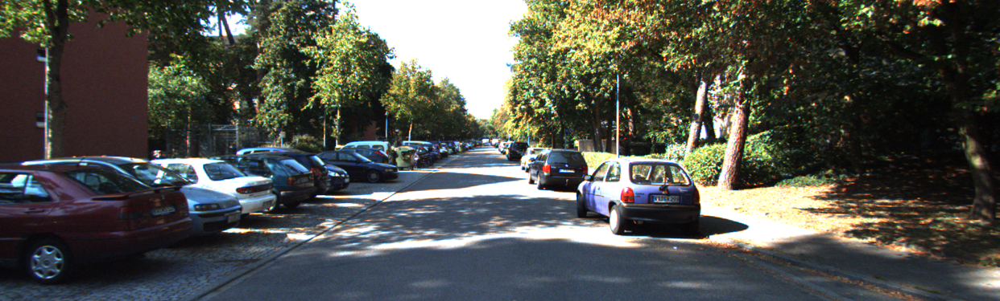
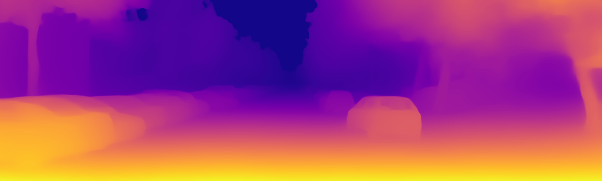

# Depth Project

Cal Poly Pomona, ECE 4990 Final Project (Spring 2026).

**Group members:** [Member 1 Name], [Member 2 Name]

Monocular depth estimation with `Depth Anything Small` as the student backbone. The contribution layered on top of the proof-of-concept fine-tune is a teacher–student distillation recipe (with `Depth Anything Large` as the teacher) combined with a multi-scale gradient loss for sharper depth boundaries. Evaluated on NYU-v2 (indoor) and a KITTI eigen-split subset (outdoor).

## What This Repo Shows
- model: `LiheYoung/depth-anything-small-hf`
- task: monocular relative depth estimation
- indoor benchmark: `NYU-v2` proof-of-concept subset
- second dataset demo: `KITTI Tiny`
- outputs: metrics, plots, qualitative panels, presentation pages, `.pptx`, uploadable local web demo

This is a real result, not a mockup. The pretrained zero-shot model worked well as a relative-depth system. The small supervised fine-tune on a tiny local subset overfit and performed worse on the held-out test split.

## Final PoC Result

| Run | AbsRel | delta1 | Test images |
| --- | ---: | ---: | ---: |
| Zero-shot | `0.1467` | `0.8381` | `59` |
| Fine-tuned | `0.1810` | `0.7163` | `59` |

Interpretation:
- the system is doing real depth estimation
- the pretrained model is the strongest result in this repo
- the two-epoch fine-tune on `450` train images overfit the small split

## Dataset Sizes
- train: `450`
- val: `60`
- test: `59`

## Diagnostics Run
- split counts verified from manifest files
- metrics summaries verified against saved JSON outputs
- source tree compiled with `python -m compileall src`
- `DepthEstimationPipeline` loaded successfully from `LiheYoung/depth-anything-small-hf`

Full note: [docs/diagnostics.md](docs/diagnostics.md)

## What The Images Mean
The NYU-v2 qualitative panels are laid out as:
- `RGB`
- `GT` ground-truth depth
- `Pred` predicted depth
- `Error` aligned pixelwise error

These panels are best read as a relative-depth check:
- does the model separate foreground from background?
- does it preserve large scene layout?
- do object boundaries land in roughly the right place?

## Key Figures

### Training Curves




### NYU-v2 Qualitative Example
Zero-shot:



Fine-tuned:



Second zero-shot example:



Second fine-tuned example:



### KITTI Tiny Demo Example
Input frame:



Predicted depth:



## Main Artifacts
- results page: [docs/results.html](docs/results.html)
- presentation page: [docs/presentation.html](docs/presentation.html)
- pptx: [docs/DepthProjectPresentation.pptx](docs/DepthProjectPresentation.pptx)
- diagnostics note: [docs/diagnostics.md](docs/diagnostics.md)
- paper: [paper/main.tex](paper/main.tex)

## Progressive Dataset Expansion
The clean way to add more datasets is:
- keep `NYU-v2` as the first benchmark and evaluation anchor
- add a second labeled dataset by generating its manifest
- merge train manifests with absolute paths
- keep validation and test fixed while the train set grows

Workflow note: [docs/multi_dataset_workflow.md](docs/multi_dataset_workflow.md)

## Method

Student: `LiheYoung/depth-anything-small-hf` (~25M params, ViT-S backbone + DPT head).
Teacher: `LiheYoung/depth-anything-large-hf` (~335M params), frozen.

Training objective:

```
L_total = (1 - alpha) * L_base(student, gt)
        + alpha       * L_distill(student, teacher)
        + beta        * L_grad(student, gt)
```

where `L_base` and `L_distill` are affine-invariant L1 (robust median + MAD normalization, then per-pixel L1) and `L_grad` is the multi-scale Sobel gradient L1 from ZoeDepth (Bhat et al. 2023). `alpha` and `beta` are swept; defaults are in `configs/distill.yaml`.

The distillation recipe is adapted from Distill-Any-Depth (He et al. 2025); the gradient loss is lifted from ZoeDepth. Both are cited in-line in `src/distill.py` and `src/metrics.py`.

## Repo Layout

```
src/         training, eval, distillation, dataset loaders, plotting
configs/     yaml configs (poc, distill, kitti_eval, smoke_test, sweeps/)
paper/       CVPR 2023 LaTeX template, refs.bib, figs/ -> docs/assets/figures
docs/        results, presentation, diagnostics, qualitative figures
references/  cloned upstream repos used for code lifts (gitignored)
tools/       smoke tests for data loaders
```

## Reproducibility

All paths are relative to the repo root. Set `data/` and `checkpoints/` per the configs, or override with CLI flags.

Prepare NYU-v2:

```bash
python src/prepare_nyu_v2.py --root data/nyu_v2 --val-count 512
```

Prepare KITTI eigen-split eval subset (requires manual KITTI download — see script for instructions):

```bash
python src/prepare_kitti.py --root data/kitti --limit 100
```

Train baseline (no distillation):

```bash
python src/train.py --config configs/poc.yaml
```

Train with distillation + gradient loss:

```bash
python src/train.py --config configs/distill.yaml
```

Evaluate on NYU-v2:

```bash
python src/eval.py --config configs/distill.yaml
```

Evaluate on KITTI:

```bash
python src/eval.py --config configs/kitti_eval.yaml
```

Hyperparameter sweep:

```bash
python src/sweep.py --base configs/distill.yaml --grid configs/sweeps/lr_only.yaml --out outputs/sweeps/lr
```

Plot training curves:

```bash
python src/plots.py --metrics-log outputs/metrics/distill_history.jsonl \
                    --per-image outputs/metrics/distill_test_per_image.csv \
                    --output-dir outputs/plots/distill
```

Plot sweep results (line):

```bash
python src/plot_sweep.py --results outputs/sweeps/lr/results.json \
                         --x learning_rate --metric abs_rel \
                         --output-dir outputs/plots/sweeps
```

## Local Web Demo

```bash
python src/demo_web_app.py
```

Open `http://127.0.0.1:8000`. Runs zero-shot inference on uploaded images, outputs under `outputs/web_demo/`.

## Status

The proof-of-concept fine-tune (Zero-shot vs Fine-tuned table above) is the baseline going into the final project. The current focus is the distillation + gradient-loss recipe described in [Method](#method); training and ablation results will replace the placeholder rows in the report and presentation once the GPU runs are complete.
