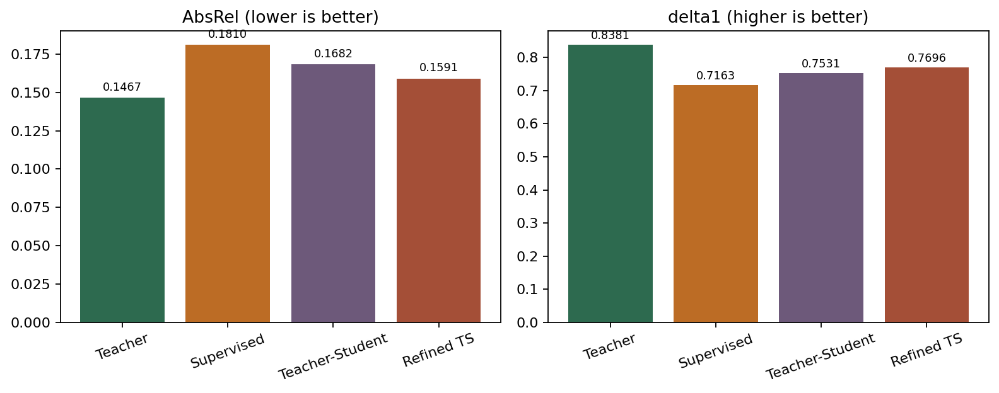
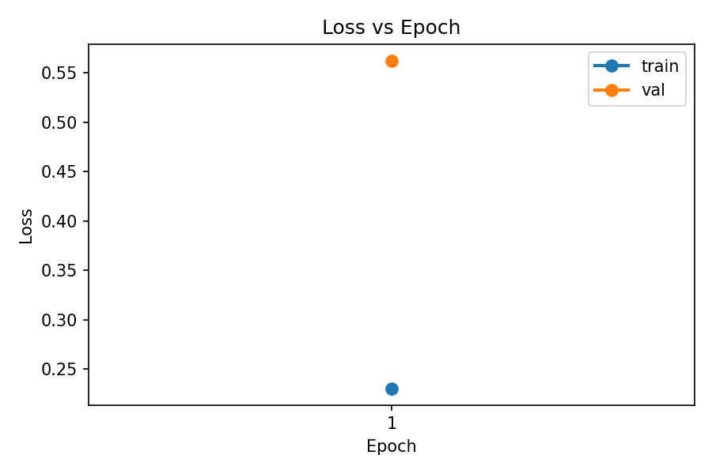
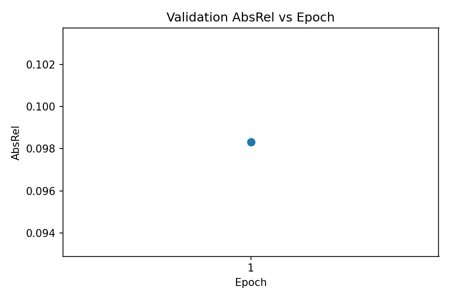
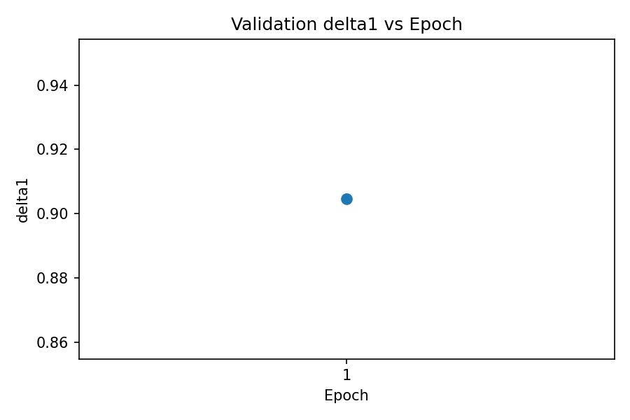
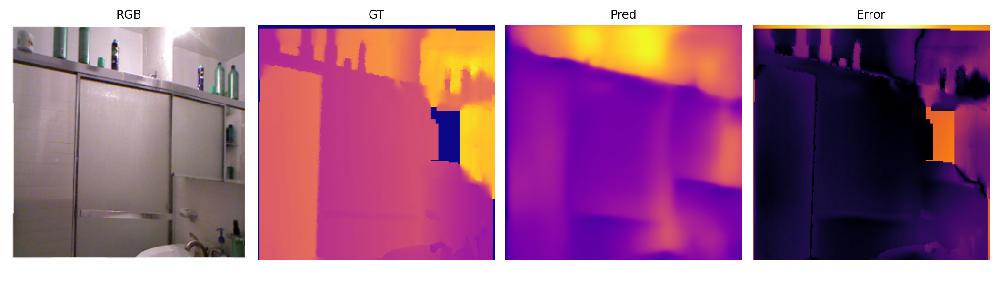

# Depth Project

Monocular depth proof of concept built from the original `Depth Anything` presentation, then extended in two directions:
- paper-style `teacher -> pseudo labels -> student` data expansion
- a lightweight architecture change on the student: an `RGB-guided residual refinement head`

## What This Repo Shows
- base teacher: `LiheYoung/depth-anything-small-hf`
- baseline architecture: `Depth Anything Small` / DPT-style monocular depth estimation
- student architecture change: `RGB + coarse depth -> residual refinement head -> refined depth`
- benchmark: `NYU-v2` proof-of-concept subset
- teacher-student expansion: `450` labeled indoor images plus `2000` teacher-pseudo-labeled indoor images
- outputs: metrics, plots, qualitative panels, comparison galleries, HTML presentation, `.pptx`, local upload demo

## Final Story
This repo now shows four runs instead of one:
1. zero-shot teacher
2. small supervised-only student
3. teacher-student student trained on labeled plus pseudo-labeled data
4. refined teacher-student student with an added residual refinement head

That is closer to the original paper’s story, while also introducing a clear architectural change instead of stopping at fine-tuning alone.

## Main Results

| Run | Training data | Architecture | AbsRel | delta1 | Test images |
| --- | --- | --- | ---: | ---: | ---: |
| Zero-shot teacher | pretrained only | Depth Anything Small | `0.1467` | `0.8381` | `59` |
| Supervised-only student | `450` labeled | Depth Anything Small | `0.1810` | `0.7163` | `59` |
| Teacher-student student | `450` labeled + `2000` pseudo-labeled | Depth Anything Small | `0.1682` | `0.7531` | `59` |
| Refined teacher-student student | `450` labeled + `2000` pseudo-labeled | `Depth Anything Small + RGB-guided residual head` | `0.1591` | `0.7696` | `59` |

Interpretation:
- the zero-shot teacher is still the best overall result
- pseudo-labeled expansion improved the student over the supervised-only run
- the refinement head improved the student again over the plain teacher-student run
- the architecture change helped, but it still did not beat the pretrained teacher

## Architecture Change
The effective architectural modification is a small residual correction module added on top of the backbone prediction:
- input to the new head: `RGB channels + coarse predicted depth`
- module: `3` convolution layers with `GELU`
- output: a residual depth correction
- final prediction: `coarse_depth + residual_scale * residual`

This keeps the original model as the coarse estimator while giving the student a trainable local refinement stage.

## Data Growth
- labeled seed set: `450`
- validation set: `60`
- held-out test set: `59`
- pseudo-labeled indoor expansion: `2000`
- total teacher-student training set: `2450`


## Why This Matches The Paper Better
- the repo explicitly shows `teacher -> pseudo labels -> student retraining`
- the student trains on materially more data than the original labeled seed set
- the local run keeps the original model family intact
- the student now also has a lightweight refinement head, so the project includes a real architecture change

## What The Images Mean
The NYU-v2 qualitative panels are laid out as:
- `RGB`
- `GT` ground-truth depth
- `Pred` predicted depth
- `Error` aligned pixelwise error

The teacher pseudo-label panels are laid out as:
- `Unlabeled RGB`
- `Teacher pseudo-depth`

## Key Figures

### Four-Run Comparison


### Refined Teacher-Student Training Curves




### NYU-v2 Sample 000000
Zero-shot teacher:


Teacher-student student:


Refined teacher-student student:



### Teacher Pseudo-Label Examples


### KITTI Tiny Demo Example
Input frame:


Predicted depth:


## Main Artifacts
- results page: [docs/results.html](docs/results.html)
- presentation page: [docs/presentation.html](docs/presentation.html)
- pptx: [docs/DepthProjectPresentation.pptx](docs/DepthProjectPresentation.pptx)
- diagnostics note: [docs/diagnostics.md](docs/diagnostics.md)
- multi-dataset note: [docs/multi_dataset_workflow.md](docs/multi_dataset_workflow.md)

Desktop package:
- `/home/alexander/Desktop/DepthProjectDemo`

## Teacher-Student Commands
Export the indoor pseudo-label pool:

```bash
cd /home/alexander/depth-project
source .venv/bin/activate
python src/prepare_indoor_pseudo_pool.py \
  --root /home/alexander/depth-project/data/unlabeled/indoor_teacher_pool \
  --limit 2000
```

Generate pseudo labels with the teacher:

```bash
python src/pseudo_label.py --config configs/teacher_student_poc.yaml
```

Train the refined student:

```bash
python src/train.py --config configs/teacher_student_refined.yaml
```

Evaluate the refined student:

```bash
python src/eval.py --config configs/teacher_student_refined.yaml \
  --checkpoint checkpoints/teacher_student_refined_best.pt
```

## Local Web Demo
Run:

```bash
cd /home/alexander/depth-project
source .venv/bin/activate
python src/demo_web_app.py
```

Then open:

```text
http://127.0.0.1:8000
```

This runs the pretrained zero-shot teacher on uploaded RGB images and saves outputs under `outputs/web_demo/`.

## Honest Conclusion
The project now does two meaningful things beyond a tiny fine-tune: it expands the data with a teacher-student pseudo-label pipeline, and it adds a lightweight refinement head to the student. The refined student is clearly better than the earlier student runs, but the pretrained teacher still remains the strongest held-out test result.
